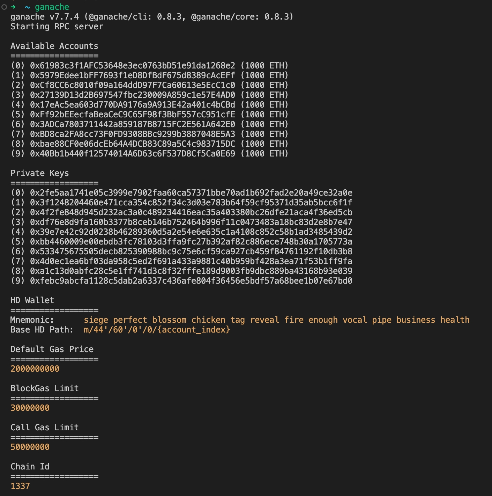
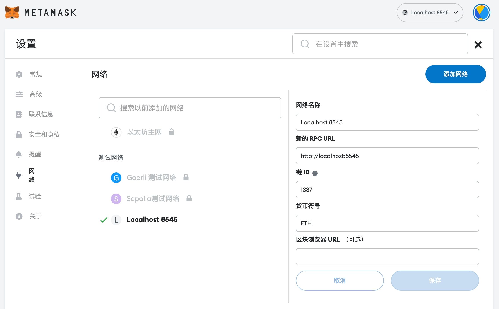
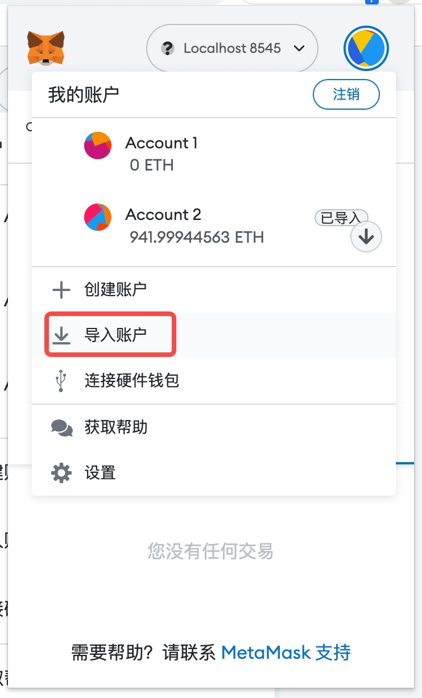

# 调用钱包进行转账

### 1. 创建账户 使用钱包metamask
安装地址：https://chrome.google.com/webstore/detail/metamask/nkbihfbeogaeaoehlefnkodbefgpgknn

### 2. 使用`ganache`启动本地区块链

https://trufflesuite.com/ganache/

```shell
yarn add -g ganache
ganache
```
启动之后会默认创建10个账户每个账户充值有1000ETH



### 3. 在metamask中
在钱包中配置本地的区块链




### 4. 引入`web3.js`开始操作

https://learnblockchain.cn/docs/web3.js/getting-started.html
https://web3js.readthedocs.io/en/v1.8.2/getting-started.html

- ##### 在页面中引入script标签

```html
<script src="https://cdnjs.cloudflare.com/ajax/libs/web3/1.8.2/web3.min.js"></script>
<script>
  const web3 = new Web3(Web3.givenProvider || "http://localhost:8545");
  // 获取当前区块数量
  web3.eth.getBlockNumber().then((res) => {
    console.log("blockNumber", res);
  });
</script>
```

- ##### 使用cra创建项目中引入 web3

```javascript
  import Web3 from 'web3';
  const web3 = new Web3(Web3.givenProvider || "http://localhost:8545");
  web3.eth.getBlockNumber().then((res) => {
    console.log("blockNumber", res);
  });
  web3.eth.getChainId().then((res) => {
    console.log("chainID", res);
  });
```
